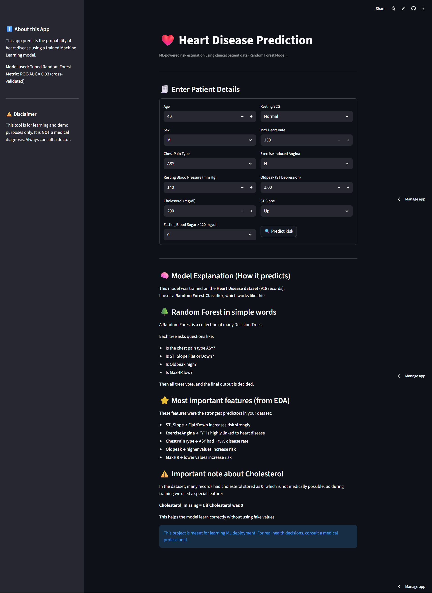
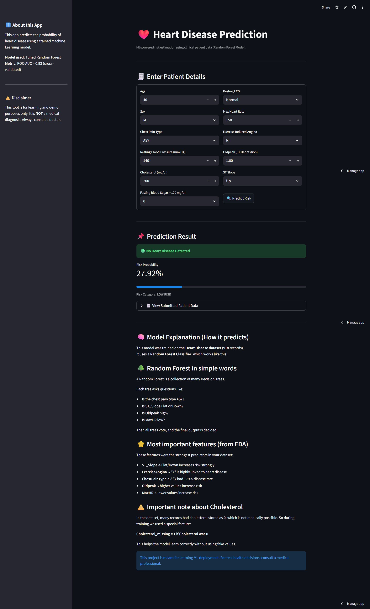

# ❤️ Heart Disease Prediction using Machine Learning

## 🌍 Live Demo

**Frontend:**  
https://heart-disease-predictions-heart.streamlit.app/

**Backend API Docs:**  
https://heart-disease-prediction-afjb.onrender.com/docs

---

## 📌 Project Overview

This project builds a complete machine learning pipeline to predict the presence of heart disease using structured clinical patient data.

The workflow includes:

- Exploratory Data Analysis (EDA)
- Feature Engineering
- Model Comparison
- Cross-Validation
- Hyperparameter Tuning
- Deployment using FastAPI and Streamlit

---

## 📊 Dataset Information

- 918 patient records  
- 11 clinical input features  
- Binary target (HeartDisease)

---

## 🔍 Key Insights from EDA

- ST_Slope, ExerciseAngina, ChestPainType strongly impact prediction.
- Cholesterol values recorded as 0 were handled using a missing indicator feature.
- MaxHR and Oldpeak show clear separation between classes.

---

## 🧠 Models Evaluated

| Model | ROC-AUC |
|-------|---------|
| Logistic Regression | 0.9298 |
| Random Forest (Tuned) | **0.9302** |

Final Model: **Tuned Random Forest**

---

## 📸 Application Preview

### 🏠 Home Screen

### 📈 Prediction Result

---

## ⚙️ Tech Stack

- Python
- Scikit-learn
- FastAPI
- Streamlit
- Render
- Git & GitHub

---

## ⚠️ Disclaimer

This project is for educational purposes only.  
It is not a medical diagnosis tool.